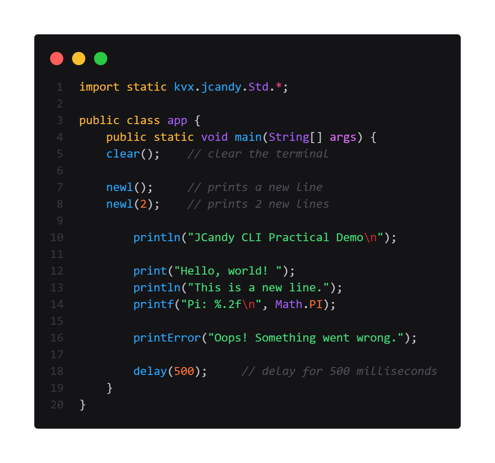

<p align="center">
   <br>
  
</p>

## Introduction
`JCandy` is a lightweight Java library that simplifies console output with easy printing, formatting, and colorful text styling, helping students and developers reduce boilerplate in terminal apps. 

## Table of Contents
- [Introduction](#introduction)
- [Features](#features)
- [Installation](#installation)
- [API Usage](#api-usage)
  - [Importing](#importing)
  - [Method Usage](#method-usage)
  - [Flavorful Class](#flavorful-class)
- [License](#license)

## Features
- Standardized CLI utilities for Java.
- Reduces repetitive code.
- Easy integration into existing projects.
- Adds colorful and styled text output for enhanced CLI aesthetics.

## Installation
To use `JCandy` in your project:

1. Download the latest release file from the [Releases](https://github.com/karlwizkrafte/JCandy/releases) page.
2. Extract the file.
3. Copy the `kvx` folder from the extracted `src/` directory into your own project's `src` directory.
4. Import and use the utilities in your Java code.

No additional setup or dependencies are required.

## API Usage

<p align="center">
   <br>
</p>

<p align="center">
  
</p>

### Importing
To use the `Std` and `Flavorful` classes, import them into your Java file:

```java
// Static import examples (for direct method access)
import static kvx.JCandy.Std.*;
import static kvx.JCandy.Flavorful.*;
```


```
// Safer (non-static) import examples (recommended for clarity and avoiding conflicts)
import kvx.JCandy.Std;
import kvx.JCandy.Flavorful;
```

### Method Usage
The `Std` class provides the following utility methods:

> [!TIP]
> **Static imports** let you call methods like `printf("Hello")` directly, but can cause naming conflicts if other classes have similar method names. For safer usage, prefer non-static imports and call methods with their class name, e.g., `Std.printf("Hello")`.

#### Output Methods
- **`printf(String message)`**
  - Prints a formatted message.
  - Example:
    ```java
    Std.printf("Hello, World!");
    ```

- **`printf(String format, Object... args)`**
  - Prints a formatted message with arguments.
  - Example:
    ```java
    Std.printf("Hello, %s!", "World");
    ```

- **`print(String message)`**
  - Prints a message without a newline.
  - Example:
    ```java
    Std.print("Hello, World!");
    ```

- **`println(String message)`**
  - Prints a message with a newline.
  - Example:
    ```java
    Std.println("Hello, World!");
    ```

- **`println(String format, Object... args)`**
  - Prints a formatted message with a newline.
  - Example:
    ```java
    Std.println("Hello, %s!", "World");
    ```

- **`printError(String message, Object... args)`**
  - Prints an error message to `System.err`.
  - Example:
    ```java
    Std.printError("Error: %s", "Something went wrong!");
    ```

#### Utility Methods
- **`newl()`**
  - Prints a single newline.
  - Example:
    ```java
    Std.newl();
    ```

- **`newl(int range)`**
  - Prints multiple newlines.
  - Example:
    ```java
    Std.newl(3); // Prints 3 new lines
    ```

- **`delay(int millis)`**
  - Pauses execution for the specified number of milliseconds.
  - Example:
    ```java
    Std.delay(1000); // Pauses for 1 second
    ```

- **`clear()`**
  - Attempts to clear the terminal screen. Falls back to printing multiple newlines if unsupported.
  - Example:
    ```java
    Std.clear();
    ```

### Flavorful Class

<p align="center">
   <br>
</p>

<p align="center">
  
</p>

> [!WARNING]  
> The `Flavorful` class is currently **experimental** and may undergo significant changes in future updates. Additionally, support for ANSI escape codes used by `Flavorful` may vary depending on the terminal environment. Ensure compatibility with your target terminal.

The `Flavorful` class provides methods for adding colors, background colors, and styles to text output. This enhances the aesthetics of CLI applications.

#### Enums

- **`Color`**: Defines text colors (e.g., `red`, `green`, `blue`, etc.). Also provides:
  - `Color.rgba(int r, int g, int b, int a)`: Custom RGB color (alpha is ignored, for convenience).
  - `Color.hex(String hex)`: Custom color from hex code (6 or 8 characters, e.g., `#FF00FF` or `#FF00FFAA`).
  - `Color.rgb(int r, int g, int b)`: Custom RGB color without alpha.

- **`BGColor`**: Defines background colors (e.g., `red`, `green`, `blue`, etc.). Also provides:
  - `BGColor.rgba(int r, int g, int b, int a)`: Custom RGB background color.
  - `BGColor.hex(String hex)`: Custom background color from hex code.
  - `BGColor.rgb(int r, int g, int b)`: Custom RGB background color without alpha.

- **`Style`**: Defines text styles (e.g., `bold`, `italic`, `underline`, etc.).

#### Methods
- **`flavor(Object... args)`**
  - Combines colors, background colors, and styles with text.
  - Example:
    ```java
    String styledText = Flavorful.flavor("Hello, World!", Flavorful.Color.red, Flavorful.Style.bold);
    Std.println(styledText);
    ```

- **Custom Colors**
  - Use RGB or hex codes for more color options:
    ```java
    // RGB foreground
    String rgbText = Flavorful.flavor("Orange Text", Flavorful.Color.rgba(255, 128, 0, 255));
    Std.println(rgbText);

    // Hex foreground
    String hexText = Flavorful.flavor("Lime Green", Flavorful.Color.hex("#00FF00"));
    Std.println(hexText);

    // RGB background
    String bgRgbText = Flavorful.flavor("Blue Background", Flavorful.BGColor.rgba(0, 0, 255, 255));
    Std.println(bgRgbText);

    // Hex background
    String bgHexText = Flavorful.flavor("Magenta Background", Flavorful.BGColor.hex("#FF00FF"));
    Std.println(bgHexText);
    ```
  - Note: Alpha is accepted for convenience but ignored in ANSI output.

- **Convenience Methods**
  - `bold(String text)`: Makes text bold.
  - `underline(String text)`: Underlines text.
  - `italic(String text)`: Makes text italic.
  - `reverse(String text)`: Reverses text colors.
  - `strikethrough(String text)`: Strikes through text.

  Example:
  ```java
  String boldText = Flavorful.bold("Bold Text");
  Std.println(boldText);
  ```